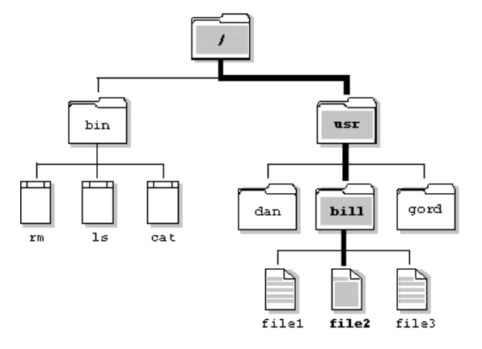

# 
ACTIVIDAD 1

### 
USAC - Facultad de Ingeniería

### 
Sistemas Operativos 1 - Sección A

### 
Segundo Semestre 2024

___

### 
Nombre: Julio Alejandro Zaldaña Ríos - Carnet: 202110206

*
Guatemala 21 de julio de 2024
*
___

### **
Preguntas sobre Conceptos Sistema Operativo, Archivo e IP.
**

 

**1. Persona 1 - Nombre: Jayron Zaldaña - 
Edad: 41 - 
Gestor Call Center**  
* **Sistema Operativo:** Un ejemplo es Android, es la base en moviles. 
* **Archivo:** Un archivo es como un word, .txt, rar, excel, una apk, que se pueden adjuntar, subir a la nube, que se descargue, compartir etc.
* **IP:** Dirección para que te reconozcan en línea.

**2. Persona 2 - Nombre: Katherine Zaldaña -
Edad: 22 -
Estudiante Química Farmaceútica**

* **Sistema Operativo:** Son como Android y Windows.
* **Archivo:** Como un documento o una carpeta en donde se puede meter información.
* **IP:** Dirección de router o dispositivo para poder ser identificado.

**3. Persona 3 - Nombre: René Aguilar -
Edad: 24 -
Estudiante Ing. Industrial** 

* **Sistema Operativo:** Para controlar un dispositivo, como windows.
* **Archivo:** Formato para guardar información.
* **IP:** Enumeración de código de un dispositivo para identificarlo.

 

_____

### **
Conclusión:
**

En esta actividad se ha consultado a tres personas con distintos perfiles sobre los conceptos de sistema operativo, archivo e IP. El objetivo es evaluar y verificar el conocimiento que las personas tienen sobre los conceptos anteriormente descritos.

- Las personas entrevistadas demostraron que tienen una comprensión clara de lo que es un sistema operativo. Talvez no a fondo como el funcionamiento, pero si reconocen el sistema operativo que tienen por ejemplo en sus teléfonos móviles.

- Todas las personas entrevistadas reconocieron que un archivo es una entidad en donde se puede almacenar información. 

- Por otro lado todas las personas mencionaron que una dirección IP sirve para identificar la dirección de un dispositivo en línea.

En resumen, los resultados han sido muy similares. La mayoría de personas a las que se le preguntó, por tener una exposición diaria a tecnología, tienen una idea clara sobre los conceptos. Talvez no un significado técnico como lo debe de tener un estudiante y un ingeniero en ciencias y sistemas. Ya que algunos detalles pueden escaparse a las personas menos familiarizadas, pero en general todos han reconocido los conceptos descritos.

Por otro lado, las personas que no están ligadas de tanta manera con la tecnología, no tendrán idea de los conceptos. Pero es por la diferencia de edad y la exposición de la tecnología. Aparte de la exposición, también el interés de la persona influye de igual manera, ya que pueden haber personas profesionales que trabajan a diario con su computadora o con su móvil, y no tienen ni idea de qué es sistema operativo.

____

### **
Glosario:
**

1. **Sistema Operativo:** Es el encargado de gestionar el hardware y permite que las aplicaciones de software se ejecuten.

Ejemplos:
- Windows
- Linux
- MacOs
- iOS (Móviles)
- Android (Móviles)

2. **Archivo:** Es una colección o un conjunto de bytes organizados que representa información. Existen archivos físicos y lógicos.
 - **Archivos Físicos:** Serán interpretados por el sistema operativo (Como un Sistema de Archivos) y se alocan en dispositivos de almacenamiento secundario.

 - **Archivos Lógicos:** Son vistos por el programa. Estos tienen una estructura definida y específica, utilizados por programas específicos. Como un archivo de texto (.txt) o una hoja de cálculo de (.xlsx)

3. **IP:** En esencia significa "Protocolo de Internet / Internet Protocol", y es un conjunto de reglas que rigen para el envío de información en una red. En este caso una dirección de IP es única en un dispositivo y sirve para identificación única del mismo en una red.

Tipos:
- IPv4: Utiliza direcciones de 32 bits en formato decimal. 
- IPv6: Utiliza direcciones de 128 bits en formato hexadecimal.

