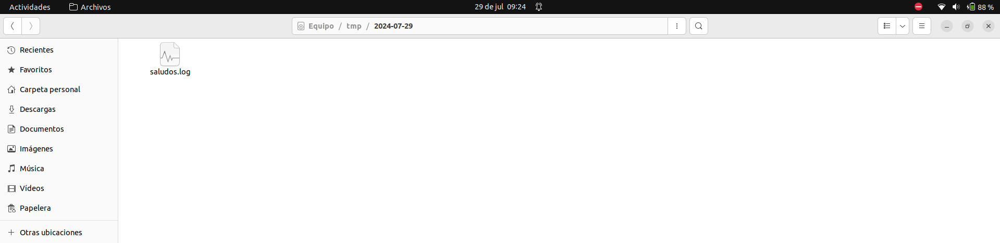

# <div align="center">ACTIVIDAD 2</div>
### <div align="center">USAC - Facultad de Ingeniería</div>
### <div align="center">Sistemas Operativos 1 - Sección A</div>
### <div align="center">Segundo Semestre 2024</div>
___

### <div align="center">Nombre: Julio Alejandro Zaldaña Ríos - Carnet: 202110206</div>
*<div align="center">Guatemala 28 de julio de 2024</div>*
___

<div style="text-align: justify;">


### **<div align="center">Script en Bash</div>**

<br>


1. **Se crea una variable GITHUB_USER por default**
La variable GITHUB_USER es igual a mi usuario de github para este ejemplo es *julizaldana*

```bash
GITHUB_USER=${GITHUB_USER:-"julizaldana"}
```

2. **Se concatena mi usuario GITHUB_USER con la URL https://api.github.com/users/**
3. **Se utiliza el comando curl para realizar la solicitud HTTP y guardar la información en un archivo .txt** Se realiza la consulta de la URL, y se obtiene la información de dicha webservice que son los datos de mi usuario de GitHub pero en formato JSON.

```bash
file="archivo.txt"
curl -s "$URL" -o $file
```
El archivo.txt contendrá ya la información del URL consultado.


4. **Se utiliza el comando jq para leer el json y obtener los atributos necesarios**
Se descarga jq con el comando:

```bash
sudo apt-get install jq
```

Y ya instalado en la distribución, ya se puede utilizar jq, para poder leer formato JSON de manera sencilla. En este caso se obtuvo los atributos de *user_id* y *created_at* de mi usuario de GitHub.

```bash
USER_ID=$(jq '.id' $file)
CREATED_AT=$(jq '.created_at' $file)
```

5. **Se configura y se utiliza el comando date para almacenar en una variable llamada DATE, con el formato YYYY-MM-DD y se crea una variable llamada hora con el formato HH:MM:SS**

```bash
DATE=$(date +%Y-%m-%d) 
HORA=$(date +%H:%M:%S)
```
*Recordar que el formato fue construido, y existen muchas variantes aparte de %Y, %m, %d, %H, %M, %S.*

Esa variable DATE, será importante porque con ella se creará una carpeta única en donde se podrá identificar mediante la fecha y la variable HORA, ayudará para identificar la hora cuando el mensaje fue enviado.

7. **Se utiliza el comando mkdir para crear la carpeta DATE dentro de /tmp**

*Se utiliza la flag -p (parents)*
```bash
DIR="/tmp/$DATE"
mkdir -p $DIR
```

8. **Se crea un archivo de salida llamado saludos.log localizado en tmp/date/saludos.log, donde se ingresará un mensaje con información consultada del webservice**

```bash
archivo_salida="$DIR/saludos.log"

echo "La url es $URL"
echo "La fecha es $DATE"
# Se redirige la salida de echo al archivo de salida, y se va concatenando
echo "Hola, $GITHUB_USER. User ID: $USER_ID. Cuenta fue creada el: $CREATED_AT. - Hora: $HORA" >> "$archivo_salida"
echo "Hola, $GITHUB_USER. User ID: $USER_ID. Cuenta fue creada el: $CREATED_AT. - Hora: $HORA"
```

9. **Dar siempre los permisos para que el script sea ejecutado**

```bash
chmod +x script.sh
```
___________________

### **<div align="center">Cronjob </div>**

**Finalmente se realiza un cronjob para poder automatizar y planificar tareas (scripts) en una cierta cantidad de tiempo**

Para ello se utiliza el comando:

```bash
crontab -e
```
Se selecciona un editor, que puede ser Nano. [1]
Luego dentro del crontab se ingresa el siguiente comando, para que ejecute el script elaborado anteriormente. 

```bash
*/5 * * * * cd Escritorio/SOPES1/so1_actividades_202110206/actividad2 ; ./script.sh
```


*Tomar en cuenta la ruta en que se encuentra el script.sh
_________

### **<div align="center">Resultado Final </div>**

Se podrá visualizar en la ruta /tmp; la carpeta que se crea por la fecha. 


Por ejemplo si se ingresa a la carpeta y se encontrará un archivo llamado saludos.log:



Dentro de este archivo, se encontrarán los resultados de los mensajes que son enviados mediante el script. Clasificados mediante la hora que se va ejecutando según el crontab. (Cada 5 minutos se concatena un mensaje)


______

### **<div align="center">E-grafía</div>**

<br>

* https://www.baeldung.com/linux/jq-command-json
* https://phoenixnap.com/kb/linux-date-command
* https://www.geeksforgeeks.org/curl-command-in-linux-with-examples/
* https://www.freecodecamp.org/news/cron-jobs-in-linux/

