# <div align="center">ACTIVIDAD 3</div>
### <div align="center">USAC - Facultad de Ingeniería</div>
### <div align="center">Sistemas Operativos 1 - Sección A</div>
### <div align="center">Segundo Semestre 2024</div>
___

### <div align="center">Nombre: Julio Alejandro Zaldaña Ríos - Carnet: 202110206</div>
*<div align="center">Guatemala 4 de agosto de 2024</div>*
___

<div style="text-align: justify;">


### **<div align="center">Control de Accesos</div>**


#### **Parte 1: Gestión de Usuarios**

1. **Se crean 3 usuarios:**

* Usuario 1 
* Usuario 2 
* Usuario 3   

Se utiliza el comando sudo adduser para crear los usuarios:

```bash
sudo adduser usuario1
sudo adduser usuario2
sudo adduser usuario3
```
<div align="center">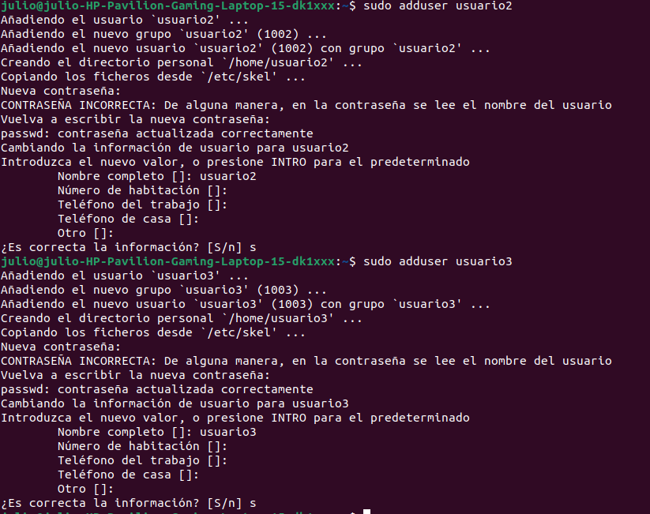</div>

Las contraseñas que tienen son:

- usuario1: *pass=usuario1*
- usuario2: *pass=usuario2*
- usuario3: *pass=usuario3*

2. **A cada usuario se le crea una nueva contraseña**

```bash
sudo passwd usuario1
sudo passwd usuario2
sudo passwd usuario3
```

Se le cambia la contraseña a cada usuario:
NOTA: Puede ser cualquier contraseña, con fines de ejemplo se asignan las siguientes contraseñas.

- usuario1: *pass=sopes1user1*
- usuario2: *pass=sopes1user2*
- usuario3: *pass=sopes1user3*

<div align="center">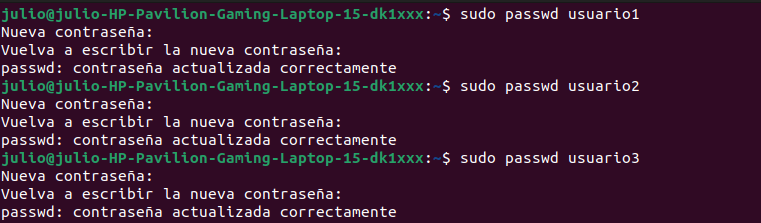</div>


3. **Se muestra la información de usuario 1**

El siguiente comando;  mostrará el UID (User ID), GID (Group ID) y los grupos a los que pertenece el usuario 1.

```bash
id usuario1
```
<div align="center">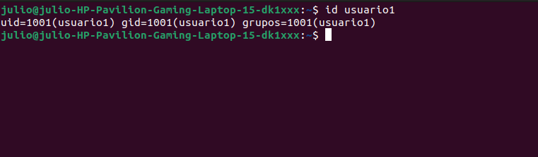</div>


4. **Se elimina el usuario3, pero se conserva su directorio principal**

Para eliminar un usuario y mantener su directorio principal (home) se ejecuta el comando:

```bash
sudo userdel usuario3
```
Para eliminar el directorio principal (home), se debe de agregar el -r.

```bash
sudo userdel -r usuario3
```

Después de ejecutar el comando userdel; se puede llegar a corroborar con id usuario3; y se muestra el mensaje que no existe ese usuario, y significa que fue eliminado correctamente.

<div align="center">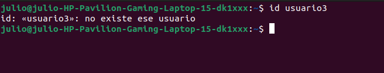</div>

_______________

<br>

#### **Parte 2: Gestión de Grupos**

1. **Se crean 2 grupos:**

* Grupo1
* Grupo2

Se utiliza el comando de sudo addgroup:

```bash
sudo addgroup group1
sudo addgroup group2
```
<div align="center">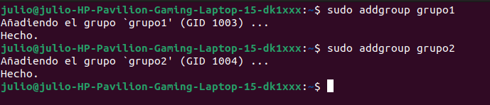</div>

2. **Se agregan los usuarios 1 y 2 a los grupos 1 y 2 respectivamente:**

Se utiliza el comando usermod y -aG para añadir un usuario a un grupo:

```bash
sudo usermod -aG grupo1 usuario1
sudo usermod -aG grupo2 usuario2
```

3. **Verificación de usuarios en grupos**

Se verifica que los usuarios hayan sido añadidos correctamente a cada grupo con los comandos:

```bash
groups usuario1
groups usuario2
```
NOTA: El comando groups, detalla todos los grupos a los que el *user* pertenece.

Se realiza la verificación y sí se han agregado los usuarios a los grupos de manera correcta.

<div align="center">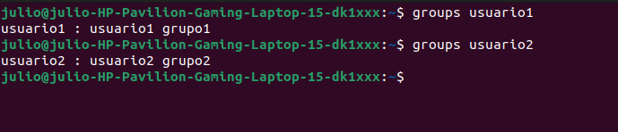</div>

4. **Se elimina el grupo2**

Para eliminar el grupo2, se debe de utilizar el comando sudo groupdel

```bash
sudo groupdel grupo2
```

_______________

<br>

#### **Parte 3: Gestión de Permisos**

1. **Creación de Archivos y Directorios:**

Primero se inicia sesión con el usuario1; con el comando:

```bash
sudo -i -u usuario1
```

- Con el usuario1 se crea el "archivo1.txt" en el directorio principal

```bash
echo "Este es el contenido del archivo 1 de la actividad 3 de Sistemas Operativos 1 2s2024" > /home/usuario1/archivo1.txt
```

- También se crea el directorio1

```bash
mkdir /home/usuario1/directorio1
```
- Y se crea el archivo2.txt

```bash
echo "Este es el contenido del archivo 2 de la actividad 3 de Sistemas Operativos 1 2s2024" > /home/usuario1/directorio1/archivo2.txt
```

<div align="center">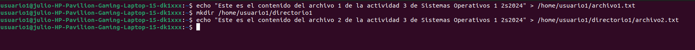</div>

<br>
<br>

2. **Se realiza una verificación de los permisos en los archivos y el directorio creado:**

Para un archivo, se utiliza ls -l
Para un directorio, se utiliza ls -ld

```bash
ls -l /home/usuario1/archivo1.txt
ls -ld /home/usuario1/directorio1
ls -l /home/usuario1/directorio1/archivo2.txt
```

Se pueden verificar los siguientes permisos para los archivos y el directorio1.

<div align="center">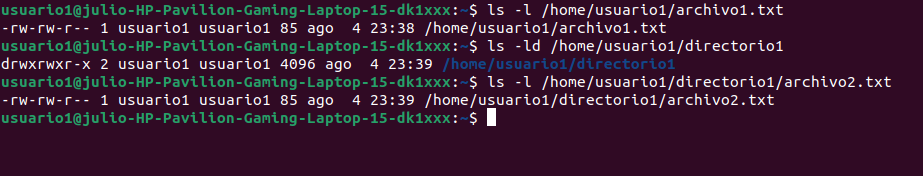</div>

NOTA: Tomar siempre en cuenta la notación:

<div align="center">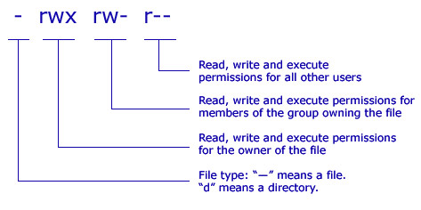</div>

<br>
<br>

3. **Modificar Permisos usando chmod con Modo Numérico**

Se modifica los permisos para el archivo1.txt, para que el usuario1 pueda leer y escribir y los grupos puedan leer.

Se debe de recordar y tener en cuenta la notación numérica/decimal/octal:

<div align="center">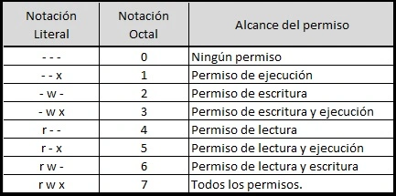</div>


- (rw-) -> 6 - U
- (r--) -> 4 - G
- (nada) -> 0  - O

Habiendo definido el permiso en modo numérico; el comando quedaría:

```bash
chmod 640 /home/usuario1/archivo1.txt
```

<br>
<br>

4. **Modificar Permisos usando chmod con Modo Simbólico**

Se le agrega permisos de ejecución al propietario del archivo2.txt; en este caso al usuario1 (u).

```bash
chmod u+x /home/usuario1/directorio1/archivo2.txt
```

Nota:
Recordar las notaciones en el modo simbólico.
- (x)=execute
- (r)=read
- (w)=write

<br>
<br>

5. **Se cambia el grupo propietario:**


Se cambia el grupo propietario del archivo2.txt a grupo1 con el comando:

```bash
sudo chown :grupo1 /home/usuario1/directorio1/archivo2.txt
```

<br>
<br>

6. **Configuración de permisos en directorio**

Se realiza la configuración del /directorio1 con el modo numérico.

- (rwx) -> 7 -> U
- (r--) -> 4 -> G
- nada -> 0 -> O

Se le añaden los permisos para que el propietario (usuario) pueda solo él entrar al /directorio1. Y para que en el grupo se pueda leer de igual manera.

Se utiliza el comando:

```bash
chmod 740 /home/usuario1/directorio1
```
<br>
<br>

7. **Comprobación de acceso**

Se Intenta acceder al `archivo1.txt` y `directorio1/archivo2.txt` como `usuario2`. 

Se realiza la verificación; y se nota cómo el permiso de directorio afecta el acceso a los archivos dentro de él.

Se inicia sesión el usuario2:

```bash
sudo -i -u usuario2
```

Se intenta acceder al archivo1.txt con el usuario2.

```bash
cat /home/usuario1/archivo1.txt
```

<div align="center"></div>


Se intenta de igual manera acceder al archivo2.txt con el usuario2.

```bash
cat /home/usuario1/directorio1/archivo2.txt
```

<div align="center">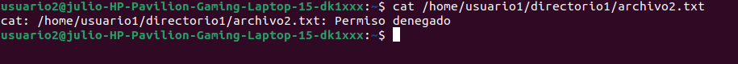</div>

Nota: Debido a los permisos establecidos, el usuario2 no puede leer el archivo1.txt y tampoco acceder al contenido de directorio1 (archivo2.txt).

Mientras que sí se intenta acceder a los archivos con el usuario1, ahora si se podrá visualizar el contenido, por los permisos configurados

<div align="center">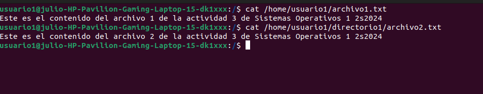</div>

<br>
<br>

8. **Verificación Final**

Finalmente se verifican los permisos para los archivos y el directorio; de nuevo con los comandos:

```bash
ls -l /home/usuario1/archivo1.txt
ls -ld /home/usuario1/directorio1
ls -l /home/usuario1/directorio1/archivo2.txt
```

Los permisos finales quedarían de la siguiente forma:
<div align="center">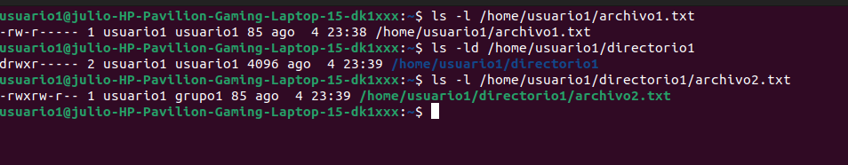</div>

Se verificaron los permisos y como se puede observar, son iguales a la forma en la que se detalló anteriormente con el comando `chown`.

* archivo1.txt = 640 = rw- r-- 
* /directorio1 = 740 = rwx r--
* /directorio1/archivo2.txt = rwxrw r-- = execute


______

### **<div align="center">Reflexión Final</div>**

* **¿Por qué es importante gestionar correctamente los usuarios y permisos en un sistema operativo?**

Gestionar correctamente a los usuarios y permisos en un sistema operativo es sumamente importante para lograr un buen nivel de seguridad, tambien útil para mantener un control de acceso ordenado a archivos y directorios del sistema y para mantener los permisos necesarios de los usuarios y grupos respectivos para que ejecuten sus roles y así se logre alcanzar la eficiencia en el sistema.

Esto quiere decir que al realizar una buena gestión de usuarios, grupos y permisos se minimizan los riesgos asociados a accesos no autorizados, posibles incovenientes entre usuarios y grupos, problemas externos etc.

* **¿Qué otros comandos o técnicas conocen para gestionar permisos en Linux?**

Comandos:

- who: Para saber la lista de usuarios logueados.
- chgrp: Cambiar el grupo propietario de un archivo o directorio.

Técnicas:
- Configurar *sudoers* correctamente: Utilizar el archivo /etc/sudoers para definir qué usuarios pueden ejecutar comandos con privilegios de sudo.


______

### **<div align="center">E-grafía</div>**

<br>

* https://developnsolve.com/removing-users-and-home-directories-on-linux
* https://www.strongdm.com/blog/add-user-to-linux-group
* https://www.hostinger.es/tutoriales/cambiar-permisos-y-propietarios-linux-linea-de-comandos/
* https://linuxhandbook.com/user-management-commands/
* https://www.pluralsight.com/blog/it-ops/linux-file-permissions