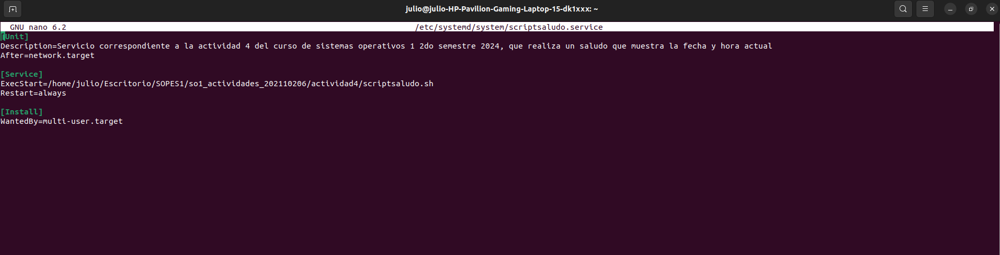
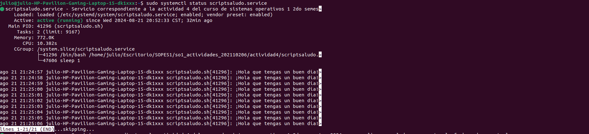
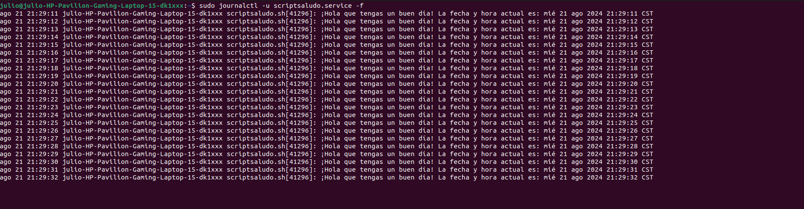

# <div align="center">ACTIVIDAD 4</div>
### <div align="center">USAC - Facultad de Ingeniería</div>
### <div align="center">Sistemas Operativos 1 - Sección A</div>
### <div align="center">Segundo Semestre 2024</div>
___

### <div align="center">Nombre: Julio Alejandro Zaldaña Ríos - Carnet: 202110206</div>
*<div align="center">Guatemala 21 de agosto de 2024</div>*
___

<div style="text-align: justify;">

### **<div align="center">Proceso de instalación de un servicio</div>**


#### **Creación de Script**

Se crea el script [scriptsaludo.sh](./scriptsaludo.sh) donde se escribe un mensaje con un saludo y se coloca la fecha actual, y este mensaje se va repitiendo cada segundo con un ciclo while.

```bash
#!/bin/bash

while true
do
  echo "¡Hola que tengas un buen día! La fecha y hora actual es: $(date)"
  sleep 1
done
```

Siempre se agregan los permisos de ejecución para el archivo scriptsaludo.sh.

```bash
sudo chmod +x ./scriptsaludo.sh
```

_____

#### **Creación de archivo de unidad systemd**

Se creó un archivo de unidad para el servicio en */etc/systemd/system/scriptsaludo.service*

Para crearlo se utiliza el comando:

```bash
sudo touch /etc/systemd/system/scriptsaludo.service
```
Y para editarlo con el editor nano:

```bash
sudo nano /etc/systemd/system/scriptsaludo.service
```

Y se coloca el siguiente contenido dentro del archivo.

```ini
[Unit]
Description=Servicio correspondiente a la actividad 4 del curso de sistemas operativos 1 2do semestre 2024, que realiza un saludo que muestra la fecha y hora actual
After=network.target

[Service]
ExecStart=/home/julio/Escritorio/SOPES1/so1_actividades_202110206/actividad4/scriptsaludo.sh
Restart=always

[Install]
WantedBy=multi-user.target

```

Se guarda el contenido en el archivo con ctrl + O y ctrl X.



_____

#### **Habilitación e Inicialización del servicio**

Se necesita elaborar una serie de comandos, para poder recargar el daemon de systemd, para que reconozca el servicio nuevo agregado.

```bash
sudo systemctl daemon-reload
```

Ahora para poder iniciar de forma automática el servicio, al iniciar el sistema, se habilita con:

```bash
sudo systemctl enable scriptsaludo.service
```

Ahora para iniciar el servicio se utiliza el comando:

```bash
sudo systemctl start scriptsaludo.service
```

Se puede verificar el estado del servicio con:

```bash
sudo systemctl status scriptsaludo.service
```

Donde se muestra que el servicio está activo y se está ejecutando.



_____

#### **Chequeo de logs del servicio**

Se pueden consultar los logs generados por el servicio, usando el journal.

```bash
sudo journalctl -u scriptsaludo.service
```

Para ver los logs en tiempo real, se agrega la opción/bandera -f:

```bash
sudo journalctl -u scriptsaludo.service -f
```

**Ejemplo de logs**



____

#### Otros comandos para gestión de servicios

Se tienen otros comandos útiles para el manejo y gestión de servicios.

Para detener un servicio, pero que siga en la configuración del sistema es:

```bash
sudo systemctl stop scriptsaludo.service
```

Para deshabilitar un servicio, y dejar que se inicie automaticamente al iniciar el sistema, se usa:

```bash
sudo systemctl disable scriptsaludo.service
```

Para eliminar un servicio; (se debe de detener y deshabilitar primero):

```bash
sudo rm /etc/systemd/system/scriptsaludo.service
```

Después se vuelve a recargar el daemon de systemd, para reconocer los cambios.

```bash
sudo systemctl daemon-reload
```

_______


### **<div align="center">E-grafía</div>** 

* https://www.shellhacks.com/systemd-service-file-example/
* https://www.suse.com/es-es/support/kb/doc/?id=000019672

