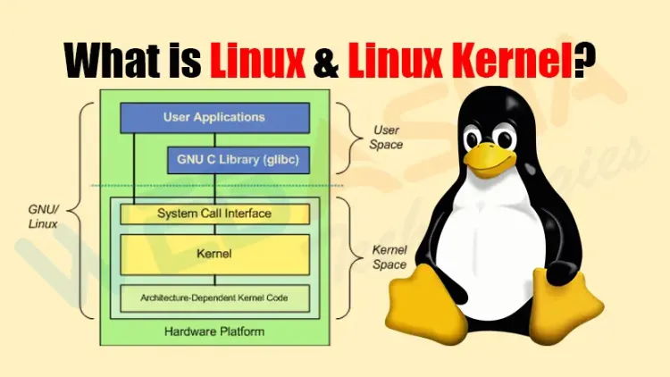
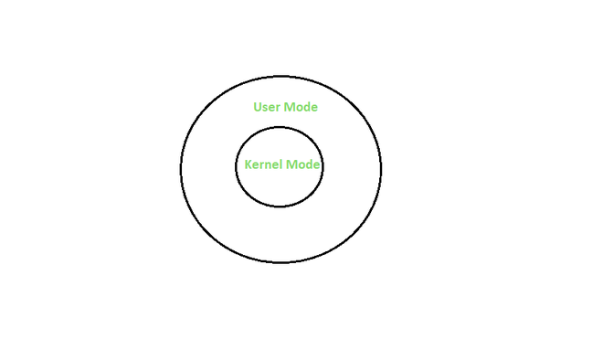

# 
ACTIVIDAD 5

### 
USAC - Facultad de Ingeniería

### 
Sistemas Operativos 1 - Sección A

### 
Segundo Semestre 2024

___

### 
Nombre: Julio Alejandro Zaldaña Ríos - Carnet: 202110206

*
Guatemala 28 de agosto de 2024
*

___

### **
¿Qué es el Kernel?
**

En sí es un complemento en el centro del sistema operativo (núcleo), que funciona como intermediario en la interacción del usuario con la máquina (hardware).

____

### **
Tipos de Kernel y sus diferencias
**

Los tipos de Kernel se dividen en dos tipos; en esenciales y en no esenciales.

#### Esenciales

* **Kernel Monolítico:** Es un tipo de kernel de gran tamaño que puede gestionar todo tipo de tarea. Se encarga de la gestión de memoria y procesos. 
* **Microkernel:** Los kernel están diseñados con pequeños tamaños tienen una clara función: evitar el colapso total del sistema en caso de un fallo. 
* **Kernel híbrido:** Este es una combinación entre el microkernel y el kernel monolítico. 

#### No Esenciales

* **Nanokernel:** Este es un kernel bastante reducido. Su uso está destinado a sistemas embebidos ya que el nivel de fiabiliad es mayor.
* **Exokernel:** Los núcleos son pequeños y su desarrollo tiene fines investigativos. El exokernel toma decisiones y está a cargo de los programas. El Kernel se limita a evitar errores en permisos de hardware.
* **Unikernel:** Es un kernel destinado a la eliminación de capas intermedias entre el hardware y las aplicaciones. Es habitual en dispositivos de bajo consumo como los IoT.
* **Anykernel:** Busca conservar las cualidades de los kernel monolíticos, pero también busca facilitar el desarrollo de controladores. 

___

### **
User vs Kernel Mode
**

####  **User Mode**

Los programas en el modo usuario (User-mode), se ejecutan con privilegios limitados y no tienen permiso a los recursos del sistema de forma directa. 

Si una aplicación quiere acceder a los recursos de l sistema, tendrá que que ir a través del kernel del sistema operativo utilizando llamadas al sistema (syscalls).

**Ejemplo:** 

Cuando se ejecuta una aplicación como MS Word, que maneja un editor de text en el sistema operativo, el sistema operativo está en modo de usuario.

####  **Kernel Mode**

Cuando el sistema arranca, el sistema comienza en el modo kernel.

En el modo kernel, el código se ejecuta con privilegios completos y se puede acceder a todos los recursos del sistema.

**Ejemplo:**  

Este modo es utilizado por el núcleo del sistema operativo y los controladores de dispositivos.

___

### **
Interruptions vs Traps
**

#### Interruption

Una interrupción es una señal emitida por el software o el hardware cuando un proceso o un evento requiere de una atención inmediata del procesador. 

Las interrupciones pueden ocurrir de forma asíncrona, ya que pueden pasar en cualquier momento. 

#### Trap

Un trap ocurre cuando el usuario del programa invoca una funcionalidad específica del Sistema Operativo.

Los traps son eventos síncronos ya que ocurren como resultado directo de la ejecución de instrucciones específicas.

#### Tabla Comparativa

| Trap| Interrupción | 
|----------|----------|
Es una señal emitida por un programa de usuario |	Es una señal emitida por un dispositivo de hardware
Proceso síncrono |	Proceso asíncrono
Puede ocurrir solo desde un dispositivo de software |	Puede ocurrir desde un dispositivo de hardware o software
Generado solo por una instrucción de un programa de usuario |	Generado por una instrucción del sistema operativo y del programa de usuario
Los traps son un subconjunto de las interrupciones |	Las interrupciones son un superconjunto de los traps
Ejecuta una funcionalidad específica en el sistema operativo y da el control al manejador de traps |	Fuerza a la CPU a activar una rutina específica del manejador de interrupciones

___

### **
E-grafía
**

* https://thepower.education/blog/que-es-el-kernel-cual-es-su-trabajo-y-como-funciona
* https://www.geeksforgeeks.org/difference-between-user-mode-and-kernel-mode/
* https://www.javatpoint.com/trap-vs-interrupt-in-operating-system