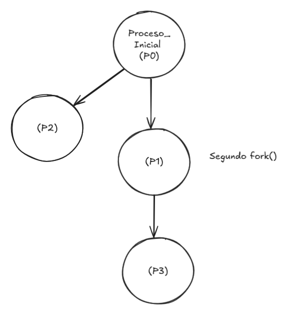

# <div align="center">ACTIVIDAD 6 - HOJA DE TRABAJO</div>
### <div align="center">USAC - Facultad de Ingeniería</div>
### <div align="center">Sistemas Operativos 1 - Sección A</div>
### <div align="center">Segundo Semestre 2024</div>
___

### <div align="center">Nombre: Julio Alejandro Zaldaña Ríos - Carnet: 202110206</div>
*<div align="center">Guatemala 12 de septiembre de 2024</div>*

___

### **<div align="center">Procesos e Hilos</div>**

#### 1. ¿Incluyendo el proceso inicial, cuantos procesos son creados por el siguiente programa? Razone su respuesta.


<div align="center"></div>

Primero que todo, hay que tomar en cuenta lo que realiza la función **fork()** en lenguaje C, ya que este crea un nuevo proceso hijo duplicado a partir del proceso original.

Y después de la llamada a **fork()**, tanto el proceso padre como el proceso hijo continuarán ejecutando el código que sigue después de la llamada.

**Algoritmo**

Al principio tenemos al proceso inicial (P0)

1. Se llama por primera vez a **fork()**, donde se crea un proceso hijo de (P0), que sería (P1).

<div align="center"></div>

2. En la segunda llamada, los dos procesos (P0) y (P1), ejecutan la segunda llamada **fork()**, lo que sería que a cada proceso, se le crea un proceso hijo.

En este caso puede ser que el hijo de P0 sea P2 y el hijo de P1 sea P3.

<div align="center"></div>

3. En la tercera llamada, ya se tienen 4 procesos. P0, P1, P2 y P3. Entonces al llamar a **fork()** por tercera vez, se crearía un proceso hijo para cada uno.

Significando que se tendría nuevos hijos, por ejemplo P4, P5, P6 y P7 respectivamente.

<div align="center"></div>


**Conclusión**

Incluyendo al proceso inicial, en la porción de código anterior, se crean 8 procesos en total.

Sería el proceso inicial y 7 procesos adicionales.

___

#### 2. Utilizando un sistema Linux, escriba un programa en C que cree un proceso hijo (fork) que finalmente se convierta en un proceso zombie. Este proceso zombie debe permanecer en el sistema durante al menos 60 segundos.

Los estados del proceso se pueden obtener del comando: ps -l

Se realizó un pequeño [programa](./zombieprocess.c) en lenguaje C, para poder crear un proceso hijo, que se convierta en un proceso Zombie por 60 segundos. 


*Comando utilizado para compilar programa*

```bash
gcc zombieprocess.c -o zombieprocess
```


Este al correr, se realiza la creación de proceso hijo respectivo y se realiza un exit(0), que significa que termina para luego convierte en un proceso zombie por 60 segundos, hasta que es finalmente eliminado del sistema.


1. **Se crea proceso con un (PID): 11995, termina y se convierte en Zombie** 


2. **Se puede verificar el estado del proceso, con el siguiente comando:**

```bash
ps aux | grep Z
```

Se puede observar que el primer proceso, tiene una Z en STAT, esto significa que está en modo Zombie. Aparte que en COMMAND dice zombieprocess, que es proviene del código del lenguaje C, que se llama zombieprocess.


3. **Pasados los 60 segundos, ya se termina el proceso Zombie y se elimina del sistema**


4. **Se puede verificar finalmente de nuevo con el comando anterior, de que pasados los 60 segundos, ya el proceso 11995 terminó ya su estado Zombie, y ha sido eliminado.**


____


#### 3. Usando el siguiente código como referencia, completar el programa para que sea ejecutable y responder las siguientes preguntas:


<div align="center"></div>

• ¿Cuántos procesos únicos son creados?
• ¿Cuántos hilos únicos son creados?

Lo que ocurre principalmente en el [código](./threadfork.c), es lo siguiente:

1. En el primer fork(), se crearía un proceso hijo, suponiendo que se tiene un proceso padre.

<div align="center"></div>

2. Luego en el segundo fork(), que está dentro del if(pid==0), significa que se crearía un proceso para el proceso hijo anterior.

<div align="center"></div>

3. Luego se tendría que acceder a la función thread_create(); que crearía un hilo, en este caso para ambos, para el proceso hijo anterior y su nuevo hijo. (Se crearían 2 hilos)

<div align="center"></div>

4. Luego en el tercer fork(), se deberían de crear nuevos procesos, relacionados a los 3 procesos que se tenían. Ya que está afuera del if. 

*NOTA:* Por concepto cada proceso debe de tener un hilo asociado. (En azul)

<div align="center"></div>


**Conclusión**

Finalmente para poder responder a las preguntas:


**• ¿Cuántos procesos únicos son creados?**

**R//** Se han creado 6 procesos únicos.

**• ¿Cuántos hilos únicos son creados?**

**R//** Se han creado 2 hilos únicos con la función **thread_create()**

Y aparte se debe de tomar en cuenta que cada proceso en Linux contiene al menos un hilo. Ya que un hilo es la unidad de ejecución dentro de un proceso.

Así que teoricamente, tendrían que haber 8 hilos al final de la ejecución del código.
