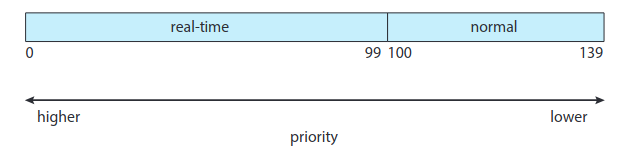
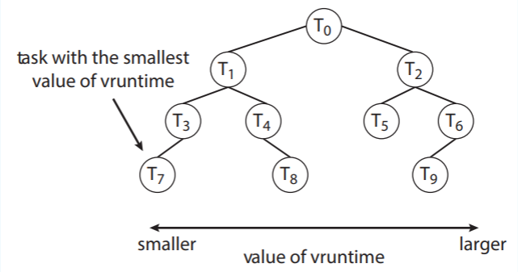

# 
ACTIVIDAD 7

### 
USAC - Facultad de Ingeniería

### 
Sistemas Operativos 1 - Sección A

### 
Segundo Semestre 2024

___

### 
Nombre: Julio Alejandro Zaldaña Ríos - Carnet: 202110206

*
Guatemala 6 de octubre de 2024
*

___

### **
Introducción a Completely Fair Scheduler (CFS) de Linux
**

CFS se define por "Completely Fair Scheduler", y es el algoritmo de scheduling por default de Linux. Este fue implementado por Ingo Molnar y fue unificado en la versión 2.6.23 de Linux. 

Originalmente fue el reemplazo para la versión anterior del vanilla scheduler: SCHED_OTHER. Al igual que en la versión 2.5 del kernel de Linux, el scheduler incluía un algoritmo de scheduling -conocido como O(1)- que corría en un tiempo constante,a pesar de la gran cantidad de tareas que podían correr en un sistema. Este era útil porque soportaba los sistemas SMP, incluía un procesador de afinidad y un load balancing entre procesadores. Y a pesar que brindaba un rendimiento excelente en sistemas SMP, pero daba respuestas muy pobres para los procesos interactivos que son comunes en muchas computadoras de escritorio. A partir de ahí es donde apareció el algoritmo Completely Fair Scheduler (CFS).

En la actualidad, CFS está haciendo espacio para el EEVDF Scheduler (Earliest eligible virtual deadline first scheduling) 

El 80% del diseño de CFS, puede ser resumido en una simple oración: CFS básicamente modela un "Un CPU Multi-tareas ideal y preciso" en un hardware.

"Un CPU multi-tareas ideal" es un CPU (no existente) que tiene 100% de capacidad física de poder y que puede correr tareas con una rapidez con precisión, de forma paralela. Por ejemplo, si hay 2 tareas corriendo, entonces una corre cada 50% de poder físico. 

En un hardware, podemos correr una simple tarea a la vez, entonces se introduce el tema de "virtual runtime". Este concepto del virtual runtime de una tarea, especifica cuando la siguiente porción de tiempo, debería de ejecutar las tareas.
El virtual runtime de una tarea es realmente el tiempo normal de corrida de el numero total de tareas corriendo.

____

### **
Scheduling en Linux
**

El proceso de Scheduling en Linux, se basa en "clases de scheduling". Cada clase está asignada con una cierta prioridad. Al utilizar diferentes clases de scheduling, el kernel puede llegar a acomodar diferentes algoritmos de scheduling basados en las necesidades del sistema y los procesos.

Para decidir que tarea se debe de correr después, el scheduler selecciona la tarea con la "Prioridad Más Alta" perteneciente a la clase de scheduling con la prioridad más alta. 

Linux implementa dos tipos de clases de scheduling:

1. La clase default o normal de scheduling: Este utiliza el algoritmo de CFS scheduling.

2. La clase de scheduling real time o en tiempo real.

______

### **
¿Qué es CFS?
**

Desde el núcleo, CFS es un algoritmo de scheduling en el kernel de Linux, que está diseñado para poder proveer un tiempo justo de CPU a cada proceso que se ejecute en el sistema. Con el objetivo primordial de que un proceso no monopolice el CPU, privando a otros de la parte que les corresponde de recursos.

**Características Generales**

- El CFS scheduler asigna una proporción de tiempo de procesamiento de CPU para cada tarea.

- CFS no utiliza valores discretos en las porciones de tiempo, sino que identifica una latencia, que es un intervalo de tiempo donde cada tarea debería de correr al menos una vez.

-  El CFS scheduler, no asigna directamente prioridades. Sino que registra que tanto se tarda una tarea en correr, manteniendo el "virtual run time" de cada tarea, usando la variable *vruntime*

- CFS soporta load balancing; usando una técnica sofisticada que iguala la carga entre núcleos de procesamiento.

____

### **
CFS y las prioridades
**

Ya que el CFS scheduler asigna una porción de tiempo de procesamiento de CPU a cada tarea. Cada proporción es calculada con base al concepto de **nice value**. 

Los rangos de nice values van de -20 a +19, donde un número bajo indica que debería de tener una prioridad relativa alta. Las tareas con nice values bajos, reciben un aproporción alta de CPU, en comparación con las tareas con nice values altos.

El nice value por default es 0. (El término nice viene de la idea de que una tarea incrementa su nice value desde 0 a +10, está siendo agradable para las otras tareas en el sistema, ya que va reduciendo su prioridad relativa. En otras palabras los procesos nice, terminan de último)
____

### **
Rendimiento de CFS
**

El Scheduler CFS de Linux, provee un eficiente algoritmo que se centra en seleccionar la mejor tarea para correr después.

EN vez de utilizar una estructura de datos estándar como una cola, cada tarea es colocada en un árbol **red-black** (árbol binario balanceado). 

Donde cada proceso ejecutandose en el sistema es representado por un nodo en el árbol, y su posición es determinada por el **virtual runtime**

Cuando una tarea está disponible para correr, se añade al árbol. Si una tarea no es posible ejecutar (por ejemplo está bloqueada esperando por un I/O), es eliminado.

Generalmente, tareas que son dadas menos tiempo de procesamiento (valores pequeños de **vruntime**) se encuentra del lado izquierdo del árbol, y las tareas que son dadas más tiempo de procesamiento se localizan en la parte de la derecha.

Para los propiedades del un árbol binario de búsqueda, el valor del nodo a la izquierda, es el valor con la llave más pequeña, que para el CFS será la tarea con la mayor prioridad.

Porque el árbol binario red-black es balanceado, para poder recorrer dentro de él, se necesitarían operaciones O(log N) donde N sería el número de nodos del árbol. Pero por razones de rendimiento, Linux utiliza el valor en la variable *rb_leftmost* y esto determina que tarea debería de ejecutarse después.

El objetivo del CFS, será mantener los tiempos de ejecución virtuales de todos los procesos lo más cerca posible, asegurando que cada proceso reciba su porción equitativa de los ciclos de CPU. 
____

### **
Referencias
**

- https://docs.kernel.org/scheduler/sched-design-CFS.html
- https://onedrive.live.com/?authkey=%21AHLEHprbk5R5HQw&cid=A4FB8E442BE8ADD6&id=A4FB8E442BE8ADD6%2169131&parId=A4FB8E442BE8ADD6%2168572&o=OneUp
