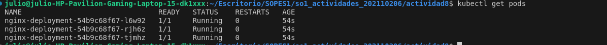

# <div align="center">ACTIVIDAD 8</div>
### <div align="center">USAC - Facultad de Ingeniería</div>
### <div align="center">Sistemas Operativos 1 - Sección A</div>
### <div align="center">Segundo Semestre 2024</div>
___

### <div align="center">Nombre: Julio Alejandro Zaldaña Ríos - Carnet: 202110206</div>
*<div align="center">Guatemala 10 de octubre de 2024</div>*

___

Instalar un ambiente local de Kubernetes utlizando minikube, kind o Docker Desktop.

### **<div align="center">Utilización de Minikube en Linux</div>**

1. Para la instalación de minikube, se deben de realizar los siguientes comandos:

```bash
curl -LO https://storage.googleapis.com/minikube/releases/latest/minikube-linux-amd64
sudo install minikube-linux-amd64 /usr/local/bin/minikube && rm minikube-linux-amd64
```


2. Luego ingresar el comando de minikube start, que instalará kubernetes dentro de un contenedor de docker de forma local.

```bash
minikube start
```


3. Instalar kubectl, por si no se tiene


Se puede comprobar de varias formas, digamos en el CLI de Linux:


O sino instalando la extensión de Kubernetes de VS Code:


___

***Desplegar un contenedor de algun web server, apache o nginx por ejemplo, en el Cluster de K8s Local.***

Para acceder al deployment y servicio, se utiliza el archivo: 


Se aplica con:

```bash
kubectl apply -f nginx-server.yaml
```

Se accede a la carpeta, donde se encuentra el archivo nginx-server.yaml, y se crea el servicio.


Se pueden verificar los pods creados por medio del archivo:



¿como ver los services o servicios?

```bash
kubectl get services
```


Para acceder al web server, se necesita la ip de minikube:

```bash
minikube ip
```


Se puede usar esa ip para acceder con el nodePort definido en el service descrito en yaml.
ip : nodePort
192.168.49.2 : 30007

http://192.168.49.2:30007

Muestra de web server:


___

**¿En un ambiente local de Kubernetes existen los nodos masters y workers, como es que esto funciona?**

En un ambiente local de Kubernetes, como en este caso se utilizó Minikube. Todos los componentes del clúster (tanto el nodo master como el nodo worker) se ejecutan en una sola máquina virtual (VM) o en un único nodo de forma local. 

En un entorno local con Minikube, el concepto de "nodos" existe, pero todos los componentes están comprimidos en una única VM que simula tanto el nodo master como el worker:

NOTAS:

* Minikube despliega tanto el plano de control (master) como el nodo worker en la misma máquina. Es decir, el API Server, Scheduler, Kubelet, Kube-proxy y otros componentes se ejecutan dentro de la misma VM.

* Simulación de un clúster completo: Aunque en un clúster real estos nodos estarían separados (en distintas máquinas físicas o virtuales), Minikube los agrupa para fines de desarrollo. Esto hace que sea una solución ligera y conveniente para crear y administrar recursos de Kubernetes localmente.
___

### **<div align="center">Referencias</div>**


- https://minikube.sigs.k8s.io/docs/start/?arch=%2Flinux%2Fx86-64%2Fstable%2Fbinary+download#Service
